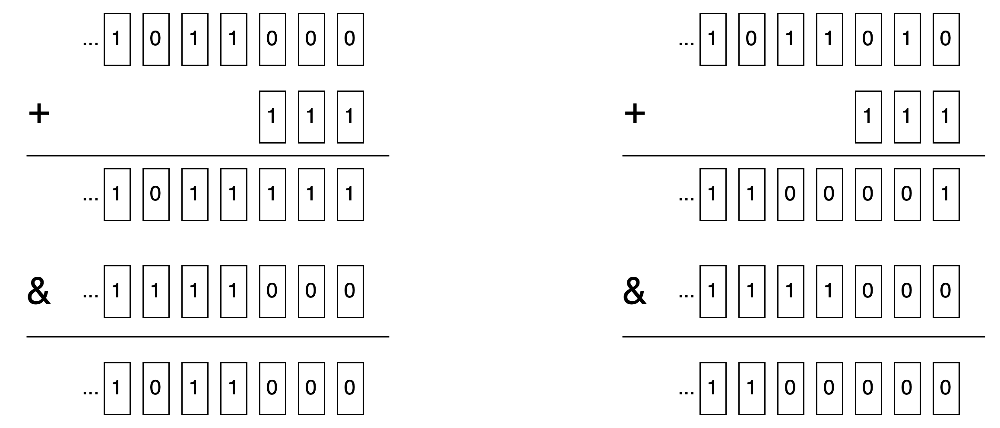

# OC 对象的内存对齐

OC 对象本质是 C/C++ 的结构体, 其内存对齐规则首先遵循 C 语言结构体的内存对齐规则(在此基础上还要额外遵循 OC 对象分配的 16 字节对齐). 下面首先整理下 C 语言结构体的内存对齐, 以及 3 个实例练习.

## C 语言结构体的内存对齐

### 结构体内存对齐的三个原则

#### 数据成员对齐规则

结构(struct)或联合(union)的数据成员, 第一个数据成员放在 offset 为 0 的地方, 以后每个数据成员存储的起始位置要从该成员大小或者成员的子成员大小(只要该成员有子成员, 比如说是数组、结构体等)的整数倍开始. 比如 int 为 4 字节, 则要从 offset 为 4 的整数倍的地址开始存储, 如果不满足, 则空出位置向后找.

#### 结构体作为成员时

如果一个结构里有某些结构体成员, 则结构体成员要从其内部最大元素大小的整数倍地址开始存储. 比如说 struct a 里存有 struct b, b 里有 char, int, double 等元素, 那 b 应该从 8 的整数倍开始存储.

#### 收尾工作

结构体的内存大小, 也就是 sizeof 的结果, 必须是其内部最大成员的整数倍, 不足的要补齐.

### 几个实例

#### 结构体1

```
struct Struct1 {
    double a;
    char b;
    int c;
    short d;
} struct1
```
首先查看每个元素所需的内存大小, double 8 字节, char 1 字节, int 4 字节, short 2 字节.  
然后根据规则从前向后排:

1. a 需要 8 字节的空间, 起始位 offset 0 是 8 的倍数, 从 0 开始排, 占用 0~7 共 8 字节大小;
2. b 需要 1 字节的空间, 当前位 offset 8 是 1 的倍数, 从 8 开始排, 占用 8 这 1 字节大小;
3. c 需要 4 字节的空间, 当前位 offset 9 不是 4 的倍数, 往后找位置, 一直到 offset 12 是 4 的倍数, 从 12 开始排, 占用 12~15 这 4 字节的大小, 前面的 9~11 这 3 个字节留空;
4. d 需要 2 字节的空间, 当前位 offset 16 是 2 的倍数, 从 16 开始排,占用 16~17 这 2 字节大小;
5. 最后收尾工作, 当前占用了 0~17 共 18 个字节的空间, 其内部最大成员 a 占 8 字节, 18 不是 8 的整数倍, 需要再额外补充至少 6 字节占到 24 字节, 才符合要求.  

所以 struct1 会占用 24 字节.

#### 结构体2

```
struct Struct2 {
    double a;
    int b;
    char c;
    short d;
} struct2
```
首先查看每个元素所需的内存大小, double 8 字节, int 4 字节, char 1 字节, short 2 字节.  
然后根据规则从前向后排:

1. a 需要 8 字节的空间, 起始位 offset 0 是 8 的倍数, 从 0 开始排, 占用 0~7 共 8 字节大小;
2. b 需要 4 字节的空间, 当前位 offset 8 是 4 的倍数, 从 8 开始排, 占用 8~11 共 4 字节大小;
3. c 需要 1 字节的空间, 当前位 offset 12 是 1 的倍数, 从 12 开始排, 占用 12 这 1 字节大小;
4. d 需要 2 字节的空间, 当前位 offset 13 不是 2 的倍数, 往后找位置, offset 14 是 2 的倍数, 从 14 开始排, 占用 14~15 这 2 字节大小;
5. 最后收尾工作, 当前占用了 0~15 共 16 个字节的空间, 其内部最大成员 a 占 8 字节, 16 是 8 的整数倍, 不需要再额外补充空间.

所以 struct2 会占用 16 字节.

#### 结构体3

```
struct Struct3 {
    double a;
    int b;
    char c;
    short d;
    int e;
    struct Struct1 str;
} struct3;
```
首先查看每个元素所需的内存大小, double 8 字节, int 4 字节, char 1 字节, short 2 字节, Struct1 如前面分析 24 字节.  
然后根据规则从前向后排:

1. a 需要 8 字节的空间, 起始位 offset 0 是 8 的倍数, 从 0 开始排, 占用 0~7 共 8 字节大小;
2. b 需要 4 字节的空间, 当前位 offset 8 是 4 的倍数, 从 8 开始排, 占用 8~11 共 4 字节大小;
3. c 需要 1 字节的空间, 当前位 offset 12 是 1 的倍数, 从 12 开始排, 占用 12 这 1 字节大小;
4. d 需要 2 字节的空间, 当前位 offset 13 不是 2 的倍数, 往后找位置, offset 14 是 2 的倍数, 从 14 开始排, 占用 14~15 这 2 字节大小;
5. e 需要 4 字节的空间, 当前位 offset 16 是 4 的倍数, 从 16 开始排, 占用 16~19 共 4 字节大小;
6. str 需要 24 字节的空间, 当前位 offset 20 不是 24 的倍数, 往后找位置, offset 24 是 24 的倍数, 从 24 开始排, 占用 24~47 这 24 字节大小;
7. 最后收尾工作, 当前占用了 0~47 共 48 个字节的空间, 其内部最大成员 str 占 24 字节, 48 是 24 的整数倍, 不需要再额外补充空间.

所以 struct3 会占用 48 字节

## OC 对象的额外对齐规则

创建一个 OC 对象时, 决定为该对象在堆上分配空间大小的核心代码在 `_class_createInstanceFromZone` 这个函数中:

```Objective-C
static ALWAYS_INLINE id
_class_createInstanceFromZone(Class cls, size_t extraBytes, void *zone,
                              int construct_flags = OBJECT_CONSTRUCT_NONE,
                              bool cxxConstruct = true,
                              size_t *outAllocatedSize = nil)
{
    ....
    // 计算内存占用大小, OC 的对象是 16 字节对齐的
    size = cls->instanceSize(extraBytes);
    if (outAllocatedSize) *outAllocatedSize = size;
    ...
    return object_cxxConstructFromClass(obj, cls, construct_flags);
}
```

具体看下 `instanceSize` 函数:

```Objective-C
inline size_t instanceSize(size_t extraBytes) const {
        if (fastpath(cache.hasFastInstanceSize(extraBytes))) {
            return cache.fastInstanceSize(extraBytes);
        }

        size_t size = alignedInstanceSize() + extraBytes;
        // CF requires all objects be at least 16 bytes.
        if (size < 16) size = 16;
        return size;
    }
```

这里有两条路径, 一条是 fastpath, 使用 `cache_t` 中的函数来获取类大小(这里的 `cache_t` 就是用于存储方法缓存的结构, 至于为什么给当前类的一个对象分配内存大小需要用到 `cache_t` 中的函数, 后续再进行探索); 如果不走 fastpath, 直接在 `instanceSize` 函数中计算获取所需大小.

我们先看不走 fastpath 的情况.
首先调用 `alignedInstanceSize` 函数计算出一个数值, 加上额外需要的字节数, 得到 size, 之后一步判断, 如果 size 小于 16, 则补足到 16. 函数的实现:

```Objective-C
uint32_t alignedInstanceSize() const {
        return word_align(unalignedInstanceSize());
    }
```

`unalignedInstanceSize` 函数最终是直接取的 `class` 中的 `ro` 结构体里的 `instanceSize` 成员变量:

```Objective-C
uint32_t unalignedInstanceSize() const {
        ASSERT(isRealized());
        return data()->ro()->instanceSize;
    }
```

获取到了这个值之后, 又使用 `word_align` 函数对该数值进行了对齐后返回, 看下 `word_align` 的实现:

```Objective-C
static inline size_t word_align(size_t x) {
    return (x + WORD_MASK) & ~WORD_MASK;
}
```

`(x + WORD_MASK) & ~WORD_MASK` 是使用位运算进行对齐的一种算法, 可以在代码中看到, 64 位系统中 `WORD_MASK` 的值为 7:

```C
#   define WORD_MASK 7UL
```

那么这个写法实际是对 x 进行 8 字节对齐. 如果把 x 进行二进制展示, 考虑 x 如果在低三位均为 0, 以及低三位的某些位为 1 的情况:



可见用此种算法, 会把低三位非零的值进位到高位, 最终低三位归零, 也即进行了 8 字节对齐.

现在已经分析完了不走 fastpath 的情况, 最终会得到一个 8 字节对齐的结果. 而经过实际代码调试, 未能发现走到这块代码的场景. 也就是说下断点发现, 都会走到 fastpath 的那个路径. 原因后续找时间分析.

现在分析 fastpath 的情况. 判断了 cache 中包含大小信息之后(`cache.hasFastInstanceSize(extraBytes)`), 调用了 cache 的 `fastInstanceSize` 函数:

```Objective-C
size_t fastInstanceSize(size_t extra) const
    {
        ASSERT(hasFastInstanceSize(extra));

        if (__builtin_constant_p(extra) && extra == 0) {
            return _flags & FAST_CACHE_ALLOC_MASK16;
        } else {
            size_t size = _flags & FAST_CACHE_ALLOC_MASK;
            // remove the FAST_CACHE_ALLOC_DELTA16 that was added
            // by setFastInstanceSize
            return align16(size + extra - FAST_CACHE_ALLOC_DELTA16);
        }
    }
```
先看下涉及到的三个宏定义:

```C
#define FAST_CACHE_ALLOC_MASK         0x1ff8
#define FAST_CACHE_ALLOC_MASK16       0x1ff0
#define FAST_CACHE_ALLOC_DELTA16      0x0008
```


这里又有两个分支, 第一个分支, 直接将 `cache` 的 `_flags` 成员变量与 `FAST_CACHE_ALLOC_MASK16` 进行位与运算的结果返回. 这是个十六进制的整数, 低四位二进制位均为 0, 与其进行位与运算之后, 所得结果必然是 16 的倍数

第二个分支, 先将 `_flags` 与 `FAST_CACHE_ALLOC_MASK` 进行位与运算, 得到的结果 size 再参与计算后, 结果传给 `align16` 函数进行 16 字节对齐:

```C
static inline size_t align16(size_t x) {
    return (x + size_t(15)) & ~size_t(15);
}
```

这里的算法与前面分析的 8 字节对齐一样, 只不过换成了 16 字节对齐. 经过这个算法, 得出的结果必然是 16 的倍数.