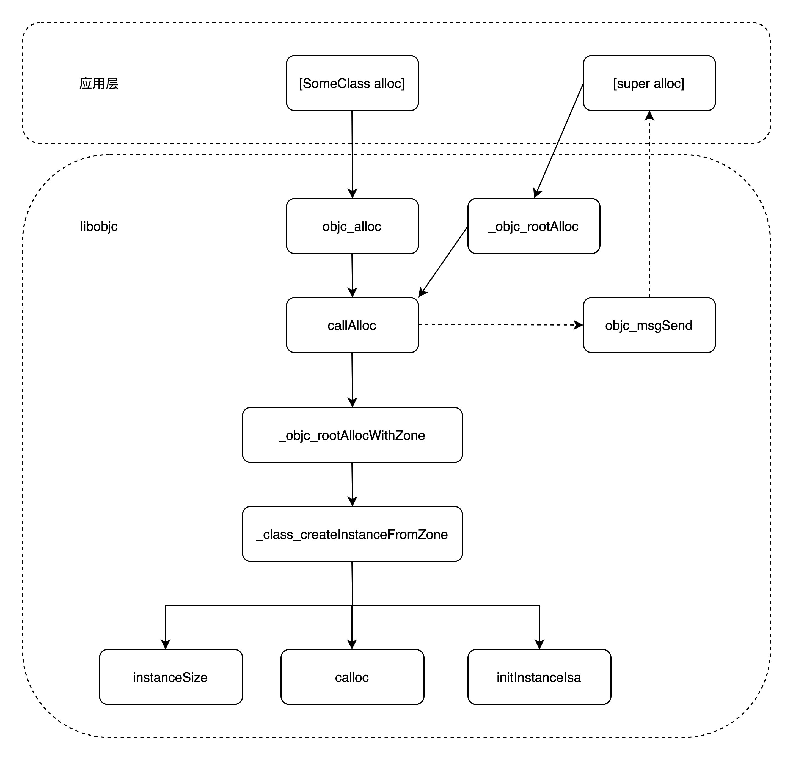

# alloc 底层原理

## 引言

区别于很多面向对象的语言, 在 OC 中创建对象的标准方式是使用 `[[SomeClass alloc] init]`， 而不是简单的调用一个 `new`/`init` 方法. OC 有意将创建对象时分配内存&对内存进行初始化这两个步骤从方法调用上就区隔开来.

本文对 `alloc` 方法的调用实现进行分析.

## 源码

相关实现在苹果的 libobjc 库中, 也就是 runtime. 截止目前最新的版本是 [824](https://opensource.apple.com/tarballs/objc4/objc4-824.tar.gz), 本文使用的版本是 [818.2](https://opensource.apple.com/tarballs/objc4/objc4-818.2.tar.gz).

## 调用流程图



## 分步解析

创建一个 `NSObject` 的子类, 并在 `main` 函数调用 `+alloc`

```Objective-C
@interface TestObject : NSObject

@end

@implementation TestObject

@end


int main(int argc, const char * argv[]) {
    @autoreleasepool {
        TestObject *obj = [TestObject alloc];
        NSLog(@"obj alloc invoked, %@", obj);
    }
    return 0;
}
```

应用层对 `alloc` 的调用初始会走到

```C++
id
objc_alloc(Class cls)
{
    return callAlloc(cls, true/*checkNil*/, false/*allocWithZone*/);
}
```

再看 callAlloc 的实现

```C++
static ALWAYS_INLINE id
callAlloc(Class cls, bool checkNil, bool allocWithZone=false)
{
    // 对于我们定义的 NSObject 的子类, 这里会进两次
#if __OBJC2__ // 判断是否为 objc2 以上版本, 现行的都是
    if (slowpath(checkNil && !cls)) return nil; // 通常走不到
    // 第一次在这里 hasCustomAWZ 会返回 false, 没有默认的 allocWithZone 实现, 所以第一次进入会判断失败, 不会调用 _objc_rootAllocWithZone, 而是会走对 objc_msgSend 的调用; 第二次进入时, 才会调用 _objc_rootAllocWithZone
    if (fastpath(!cls->ISA()->hasCustomAWZ())) {    // 通常走这里, 判断条件是取 isa 中的标识位来确认是否有默认的 allocWithZone 实现
        return _objc_rootAllocWithZone(cls, nil);
    }
#endif
    // 转化为对 objc_msgSend 调用, 走方法分发流程, 调用到父类的 +alloc 方法
    // No shortcuts available.
    if (allocWithZone) {
        return ((id(*)(id, SEL, struct _NSZone *))objc_msgSend)(cls, @selector(allocWithZone:), nil);
    }
    // 调用父类的 +alloc 
    return ((id(*)(id, SEL))objc_msgSend)(cls, @selector(alloc));
}
```

`callAlloc` 如果转为了 `objc_msgSend`, 会通过方法分发流程调用到父类也就是 NSObject 的 +alloc 方法, 可以看到这里也是一个简单函数调用

```Objective-C
+ (id)alloc {
    return _objc_rootAlloc(self);
}
```

`_objc_rootAlloc` 也是直接调用了 `callAlloc`, 这就进入了对 `callAlloc` 第二次调用

```C++
id
_objc_rootAlloc(Class cls)
{
    return callAlloc(cls, false/*checkNil*/, true/*allocWithZone*/);
}
```

在对 `callAlloc` 的第二次调用里走到 `_objc_rootAllocWithZone`, 简单函数调用

- [ ] 但是没有理解为什么这里要标记为 NEVER_INLINE

```C++
NEVER_INLINE
id
_objc_rootAllocWithZone(Class cls, malloc_zone_t *zone __unused)
{
    // allocWithZone under __OBJC2__ ignores the zone parameter
    return _class_createInstanceFromZone(cls, 0, nil,
                                         OBJECT_CONSTRUCT_CALL_BADALLOC);
}
```

来看 `_class_createInstanceFromZone`

```C++
static ALWAYS_INLINE id
_class_createInstanceFromZone(Class cls, size_t extraBytes, void *zone,
                              int construct_flags = OBJECT_CONSTRUCT_NONE,
                              bool cxxConstruct = true,
                              size_t *outAllocatedSize = nil)
{
    ASSERT(cls->isRealized());

    // Read class's info bits all at once for performance
    // 是否有 C++ 构造函数
    bool hasCxxCtor = cxxConstruct && cls->hasCxxCtor();
    // 是否有 C++ 析构函数
    bool hasCxxDtor = cls->hasCxxDtor();
    // 是否可以创建 NonPointer_ISA
    bool fast = cls->canAllocNonpointer();
    size_t size;
    // 计算内存占用大小, OC 的对象是 16 字节对齐的
    size = cls->instanceSize(extraBytes);
    if (outAllocatedSize) *outAllocatedSize = size;

    id obj;
    if (zone) { // 前面传参过来是 nil, 所以走下面
        obj = (id)malloc_zone_calloc((malloc_zone_t *)zone, 1, size);
    } else {
        obj = (id)calloc(1, size);
    }
    if (slowpath(!obj)) {
        if (construct_flags & OBJECT_CONSTRUCT_CALL_BADALLOC) {
            return _objc_callBadAllocHandler(cls);
        }
        return nil;
    }
    // 两种方式来设置给对象分配的这块内存空间里第一个成员变量, 也就是 isa 的值
    if (!zone && fast) { // 通常走这种
        obj->initInstanceIsa(cls, hasCxxDtor);
    } else {
        // Use raw pointer isa on the assumption that they might be
        // doing something weird with the zone or RR.
        obj->initIsa(cls);
    }

    if (fastpath(!hasCxxCtor)) {
        return obj;
    }

    construct_flags |= OBJECT_CONSTRUCT_FREE_ONFAILURE;
    return object_cxxConstructFromClass(obj, cls, construct_flags);
}
```

这是核心方法, 主要做了三件事:
- 计算对象需要的内存空间大小
- 根据计算得到的大小在堆上申请空间
- 设置 isa 成员变量的值

1.计算内存空间大小:

```C++
inline size_t instanceSize(size_t extraBytes) const {
        if (fastpath(cache.hasFastInstanceSize(extraBytes))) {
            return cache.fastInstanceSize(extraBytes);
        }

        size_t size = alignedInstanceSize() + extraBytes;
        // CF requires all objects be at least 16 bytes.
        if (size < 16) size = 16;
        return size;
    }
```

走 `fastInstanceSize`, 可以看到是通过位运算的方式实现 16 字节对齐

```C++
size_t fastInstanceSize(size_t extra) const
    {
        ASSERT(hasFastInstanceSize(extra));

        if (__builtin_constant_p(extra) && extra == 0) {
            return _flags & FAST_CACHE_ALLOC_MASK16;
        } else {
            size_t size = _flags & FAST_CACHE_ALLOC_MASK;
            // remove the FAST_CACHE_ALLOC_DELTA16 that was added
            // by setFastInstanceSize
            return align16(size + extra - FAST_CACHE_ALLOC_DELTA16);
        }
    }
```

2.申请内存

这里很简单, 调用 `calloc` 申请内存空间

3.初始化 isa 的值, 使得这个对象和类通过 isa 相关联

```C++
inline void 
objc_object::initInstanceIsa(Class cls, bool hasCxxDtor)
{
    ASSERT(!cls->instancesRequireRawIsa());
    ASSERT(hasCxxDtor == cls->hasCxxDtor());

    initIsa(cls, true, hasCxxDtor);
}
```

调用 `initIsa` 函数, 就是设置各二进制位. 对于当前的 OC 版本, isa 一般是一个 NonPointer_ISA, 存储了诸如类对象地址(通过位运算获取), 引用计数(`extra_rc`), 是否有 C++ 析构函数等信息

```C++
inline void 
objc_object::initIsa(Class cls, bool nonpointer, UNUSED_WITHOUT_INDEXED_ISA_AND_DTOR_BIT bool hasCxxDtor)
{ 
    ASSERT(!isTaggedPointer()); 
    
    isa_t newisa(0);

    if (!nonpointer) {
        newisa.setClass(cls, this);
    } else {
        ASSERT(!DisableNonpointerIsa);
        ASSERT(!cls->instancesRequireRawIsa());


#if SUPPORT_INDEXED_ISA
        ASSERT(cls->classArrayIndex() > 0);
        newisa.bits = ISA_INDEX_MAGIC_VALUE;
        // isa.magic is part of ISA_MAGIC_VALUE
        // isa.nonpointer is part of ISA_MAGIC_VALUE
        newisa.has_cxx_dtor = hasCxxDtor;
        newisa.indexcls = (uintptr_t)cls->classArrayIndex();
#else
        newisa.bits = ISA_MAGIC_VALUE;
        // isa.magic is part of ISA_MAGIC_VALUE
        // isa.nonpointer is part of ISA_MAGIC_VALUE
#   if ISA_HAS_CXX_DTOR_BIT
        newisa.has_cxx_dtor = hasCxxDtor;
#   endif
        newisa.setClass(cls, this);
#endif
        newisa.extra_rc = 1;
    }

    // This write must be performed in a single store in some cases
    // (for example when realizing a class because other threads
    // may simultaneously try to use the class).
    // fixme use atomics here to guarantee single-store and to
    // guarantee memory order w.r.t. the class index table
    // ...but not too atomic because we don't want to hurt instantiation
    isa = newisa;
}
```
